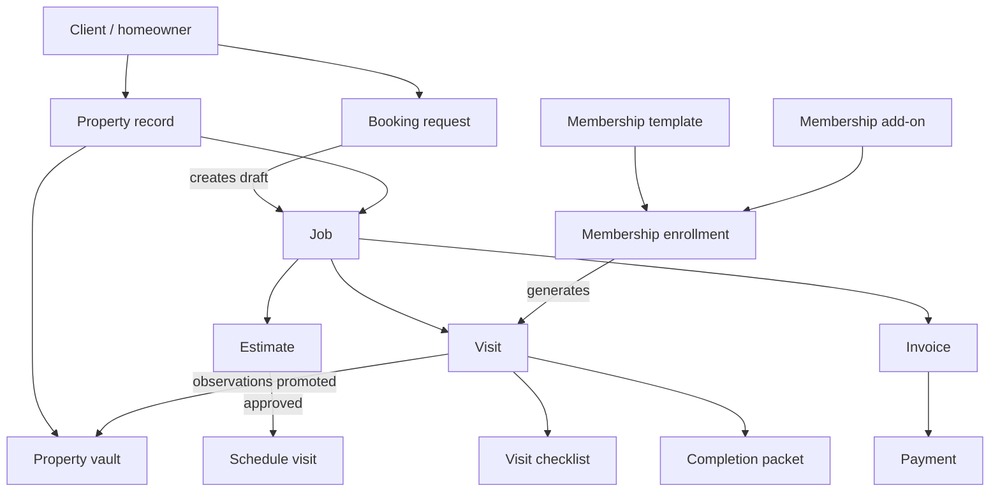

# Dovetails Domain Simplification Audit

Date: 2026-05-14

Scope: jobs, visits, work orders, maintenance plans, estimates, booking requests, property records, checklists, and workflow surfaces.

## Executive Summary

The codebase has a solid core: `clients -> properties -> jobs -> visits -> estimates/invoices` is already the right backbone for a relationship-based residential maintenance business. The main architectural risk is not missing capability. It is overlapping surface area and naming drift around "job", "visit", "booking", "pipeline", "maintenance plan", "membership", and "subscription".

The simplest product model should be:

- A `client` is the homeowner relationship.
- A `property` is the long-term maintenance record.
- A `job` is the business commitment and customer-facing work thread.
- A `visit` is a scheduled field appointment under a job.
- An `estimate` is a priced proposal for a job.
- A `booking_request` is intake only, not a second work object.
- A `membership` is a recurring service enrollment, currently stored in `maintenance_plans`.
- A `checklist` is visit execution evidence, not a separate inspection workflow.

The recommended direction is to keep the database mostly backward compatible while renaming product language and adding compatibility views/aliases where needed.

## Domain Map

### Homeowner Relationship

| Concept | Current tables/code | Canonical role | Notes |
| --- | --- | --- | --- |
| Client | `clients` | Homeowner or relationship account | Owns relationship, contact preferences, consent, portal token. |
| Property | `properties`, `property_vault_items`, `property_vault_item_media`, `document_links.property_id` | The living home record | This is a strategic asset and should not be hidden under generic documents. |
| Communication | `communications_log` | Relationship touch history | Correctly links to booking/job/visit. Should eventually also link property where available. |

### Work Lifecycle

| Concept | Current tables/code | Canonical role | Notes |
| --- | --- | --- | --- |
| Booking request | `booking_requests`, `createIntakeRecords` | Intake record | Captures raw request and review state only. It should not become a work order. |
| Job | `jobs` | Work thread / customer commitment | Canonical parent for estimate, visit, invoice, expenses, documents. |
| Visit | `visits` | Scheduled appointment / field execution | Canonical field unit. Generated membership visits still remain visits. |
| Work order | No table; implied by job+visit | UI wording only if needed | Do not add a `work_orders` table. A field "work order" is the visit detail screen. |
| Pipeline stage | `apps/web/lib/pipeline/stages.ts` | Derived presentation state | Should remain derived, not stored. |

### Revenue and Pricing

| Concept | Current tables/code | Canonical role | Notes |
| --- | --- | --- | --- |
| Estimate | `estimates`, `estimate_line_items`, `estimate_options` | Proposal and pricing guardrail | Core infrastructure. Keep structured. |
| Change order | `change_orders`, `change_order_line_items` | Amendment to approved estimate | Acceptable as a child of estimate, not parallel work. |
| Invoice/payment | `invoices`, `payments` | Collection record | Outside audit focus, but tightly coupled to job completion. |
| Price book | `price_book`, `price_book_modifiers` | Estimating input catalog | Should feed estimates, not become service taxonomy everywhere. |

### Recurring Maintenance

| Concept | Current tables/code | Canonical role | Notes |
| --- | --- | --- | --- |
| Maintenance plan | `maintenance_plans` | Existing physical table for membership enrollment | Product language should be `membership`. Keep table for compatibility. |
| Plan template | `plan_templates` | Membership tier template | Good separation from enrollment. |
| Plan add-on | `plan_addons`, `subscription_addons` | Membership add-on catalog/enrollment | Rename `subscription_addons` in code/docs to `membership_addons` later. |
| Membership visit phase | `visits.membership_visit_phase` | Visit execution phase for membership visits | Belongs on visit, because it guides tech behavior. |

### Documentation and Trust Evidence

| Concept | Current tables/code | Canonical role | Notes |
| --- | --- | --- | --- |
| Checklist | `visit_checklist_items` | Structured visit walkthrough | Keep visit-scoped. Do not create a generic checklist system yet. |
| Completion packet | `completion_packets` | Closeout proof | Visit-scoped. |
| Vault item | `property_vault_items` | Durable property fact | Property-scoped, optionally sourced from visit. |
| Document link | `document_links` | External document pointer | Keep generic, but do not let it replace property history. |

## Identified Overlaps

### 1. Jobs and Visits both hold lifecycle status

Evidence:

- `jobs.status` includes `scheduled`, `in_progress`, and `completed` in [001_core_schema.sql](/home/nick/ai-fsm-deploy-clean/db/migrations/001_core_schema.sql:78).
- `visits.status` also includes `scheduled`, `in_progress`, and `completed` in [001_core_schema.sql](/home/nick/ai-fsm-deploy-clean/db/migrations/001_core_schema.sql:95).
- Visit transitions auto-advance parent job status in [visits transition route](/home/nick/ai-fsm-deploy-clean/apps/web/app/api/v1/visits/[id]/transition/route.ts:245).

Recommendation:

Keep both statuses, but define them differently:

- `job.status` = customer/business lifecycle.
- `visit.status` = field appointment lifecycle.

Avoid exposing both as equivalent "status" in UI. In job views, show visit status as "next appointment" or "field status".

### 2. Booking requests create jobs immediately

Evidence:

- `booking_requests` stores `client_id`, `property_id`, `job_id`, and `visit_id` in [021_booking_requests.sql](/home/nick/ai-fsm-deploy-clean/db/migrations/021_booking_requests.sql:7).
- Public booking creates a client, property, job, and booking request in [records.ts](/home/nick/ai-fsm-deploy-clean/apps/web/lib/intake/records.ts:231).

Tradeoff:

This simplifies the pipeline because every lead has a job. The downside is that low-quality or duplicate requests become real jobs before review.

Recommendation:

For backward compatibility, keep the current behavior, but name this clearly:

- `booking_requests` = intake source.
- Linked `jobs` in `draft` = intake work thread.

Longer term, add `jobs.source = 'booking_request' | 'manual' | 'membership' | 'realtor_baseline'` and treat draft jobs from booking as "unaccepted work threads" until reviewed.

### 3. Pipeline stage, customer stage, job status, booking status overlap

Evidence:

- Pipeline has 11 derived stages in [pipeline/stages.ts](/home/nick/ai-fsm-deploy-clean/apps/web/lib/pipeline/stages.ts:1).
- Customer stage has a separate 5-stage derived model in [stages.ts](/home/nick/ai-fsm-deploy-clean/packages/domain/src/stages.ts:1).
- Booking requests have statuses `pending`, `needs_info`, `duplicate`, `reviewed`, `converted`, `cancelled`.

Recommendation:

Keep derived stages, but publish one canonical rule:

- Stored statuses are operational facts.
- Pipeline/customer stages are read models only.
- No migration should add `pipeline_stage` to the database.

Simplify UI labels to five high-level columns where possible:

1. Intake
2. Estimate
3. Schedule
4. Field Work
5. Closeout

### 4. Maintenance plan, membership, and subscription naming drift

Evidence:

- Physical table is `maintenance_plans` in [015_client_portal.sql](/home/nick/ai-fsm-deploy-clean/db/migrations/015_client_portal.sql:22).
- Later migrations add membership fields to the same table in [025_membership_vault_foundation.sql](/home/nick/ai-fsm-deploy-clean/db/migrations/025_membership_vault_foundation.sql:4).
- UI page title says "Subscriptions" while the route remains `/app/maintenance-plans` in [maintenance-plans page](/home/nick/ai-fsm-deploy-clean/apps/web/app/app/maintenance-plans/page.tsx:48).
- `subscription_addons` points at `maintenance_plans`.

Recommendation:

Canonical product term: `membership`.

Backward-compatible technical plan:

- Keep `maintenance_plans` table.
- Add a database view `memberships` over `maintenance_plans` when needed.
- Rename route labels from "Maintenance Plans" and "Subscriptions" to "Memberships".
- New code should use `membership` in variables, labels, API response names, and docs.
- Defer physical table rename until usage stabilizes.

### 5. Work order is implicit and should stay implicit

There is no `work_orders` table, which is good. Adding one would duplicate `jobs` and `visits`.

Canonical rule:

- Office-facing work object = `job`.
- Tech-facing work object = `visit`.
- Customer-facing appointment = `visit`.
- If a printable "work order" is required, render it from `visit + job + property + checklist`, not a new entity.

### 6. Checklists and property vault both document property condition

Evidence:

- Visit checklist is visit-scoped in [011_visit_checklist.sql](/home/nick/ai-fsm-deploy-clean/db/migrations/011_visit_checklist.sql:20).
- Property vault items are property-scoped and optionally linked to a visit in [027_digital_home_vault.sql](/home/nick/ai-fsm-deploy-clean/db/migrations/027_digital_home_vault.sql:2).

Recommendation:

Keep both. Boundary:

- Checklist = what the technician observed during one visit.
- Vault = durable fact worth carrying forward.

Avoid a generic `inspection_items` table until there is a real second inspection workflow.

### 7. `status_history` duplicates `audit_log` for status changes

Evidence:

- `audit_log` is generic in [001_core_schema.sql](/home/nick/ai-fsm-deploy-clean/db/migrations/001_core_schema.sql:191).
- `status_history` separately tracks entity status changes.

Recommendation:

Keep both only if `status_history` is used for timeline UI and customer/staff workflow history. Otherwise, derive status timeline from `audit_log`. If keeping both, centralize status writes through one helper and add tests so booking/job/visit transitions never forget to write status history.

## Canonical Terminology

| Use this | Avoid in product UI | Database compatibility |
| --- | --- | --- |
| Client | Customer, account, contact | `clients` stays. |
| Property | Home, site, location | `properties` stays. |
| Job | Project, work order, case | `jobs` stays. |
| Visit | Appointment, service call, work order | `visits` stays. |
| Membership | Maintenance plan, subscription | `maintenance_plans` stays for now. |
| Membership template | Plan template | `plan_templates` ok; UI says "Membership Templates". |
| Membership add-on | Subscription add-on | `subscription_addons` stays for now. |
| Booking request | Lead, request, intake item | `booking_requests` stays. |
| Estimate | Quote, proposal | `estimates` stays. UI can say "Estimate". |
| Change order | Add-on estimate, revised work | `change_orders` stays. |
| Checklist | Inspection, assessment form | `visit_checklist_items` stays. |
| Property vault | Digital home vault, asset list | `property_vault_items` stays. |
| Pipeline stage | Workflow state | Derived only, no table. |

## Domain Boundaries

### Booking Request

Owns:

- Submitted contact details.
- Raw service request text.
- Preferred date/time.
- Duplicate/review state.
- Linkage to created records.

Does not own:

- Scope acceptance.
- Pricing.
- Scheduling truth after conversion.
- Field execution.

### Job

Owns:

- Accepted or reviewable work thread.
- Client/property context.
- Business lifecycle.
- Job category and intake fit.
- Relationship to estimates, visits, invoices, expenses, documents.

Does not own:

- Per-appointment technician progress.
- Checklist rows.
- Durable property facts.

### Visit

Owns:

- Scheduled time window.
- Assigned tech.
- Field lifecycle.
- Field notes, parts, media, checklist, time logs, completion packet.
- Membership visit execution phase when generated from membership.

Does not own:

- Customer pricing.
- Overall job acceptance.
- Membership enrollment terms.

### Membership

Owns:

- Client/property recurring enrollment.
- Tier, annual visit count, included labor cap, routing zone, renewal date, status.
- Template/add-on linkage.

Does not own:

- Individual field execution beyond generating visits.
- Estimate/invoice pricing logic for non-included work.

### Estimate

Owns:

- Scope pricing.
- Line items/options.
- Pricing guardrails and review.
- Customer approval/decline.

Does not own:

- Scheduling state.
- Technician closeout.

## Workflow Relationship Diagram



## Simplified Architecture Proposal

### Canonical Aggregate Roots

Use these as mental ownership boundaries:

1. Relationship aggregate: `client`, `property`, `communications_log`.
2. Work aggregate: `job`, `visit`, `estimate`, `invoice`, `expense`.
3. Membership aggregate: `maintenance_plans` as physical table, `membership` as code/product concept.
4. Property history aggregate: `property_vault_items`, `document_links`, visit-derived evidence.

### Read Models

Keep these derived:

- Pipeline board.
- Customer portal stage.
- Membership dashboard.
- My Day/Field Mode.
- Schedule.

Do not store separate workflow records unless they represent durable business facts.

### UI Navigation Simplification

Recommended top-level operations grouping:

- Pipeline: office view of all open work.
- Schedule: calendar view of visits.
- Field: tech execution.
- Jobs: searchable archive/detail.
- Memberships: recurring enrollments.
- Clients/Properties: relationship and home history.
- Estimates/Invoices/Price Book: business/pricing.

Risk: Today, `Jobs`, `Visits`, `Schedule`, `Field Mode`, `My Day`, and `Pipeline` can feel like separate systems. Field techs should mostly live in `My Day` or `Field`; office users should mostly live in `Pipeline` and `Schedule`.

## Migration Recommendations

### Phase 1: Naming cleanup, no schema break

- Rename UI labels:
  - "Maintenance Plans" and "Subscriptions" -> "Memberships".
  - "Plan Templates" -> "Membership Templates".
  - "Add-ons" -> "Membership Add-ons".
- Keep routes and tables stable.
- Add docs comments in API routes: `maintenance_plans` is the membership enrollment table.
- Update new variables/types to prefer `membership` while accepting old API field names.

### Phase 2: Compatibility views and API aliases

- Add view:

```sql
CREATE OR REPLACE VIEW memberships AS
SELECT * FROM maintenance_plans;
```

- Optional view:

```sql
CREATE OR REPLACE VIEW membership_addons AS
SELECT * FROM subscription_addons;
```

- Keep write paths on original tables until PostgreSQL view write rules are intentionally designed.

### Phase 3: Source and relationship hardening

- Add `jobs.source` with values such as `manual`, `booking_request`, `membership`, `realtor_baseline`.
- Add `jobs.source_id` only if needed, or keep explicit FK columns on source tables. Simpler option: keep explicit existing links and add only `source`.
- Add indexes for common property history reads:
  - `visits(job_id, completed_at)`
  - `jobs(account_id, property_id, created_at DESC)`
  - `estimates(account_id, property_id, created_at DESC)`

### Phase 4: Status history consistency

- Decide whether `status_history` is a first-class timeline table.
- If yes, make every status transition helper write it.
- If no, remove new use and derive from `audit_log`.

### Phase 5: Optional physical rename

Only after UI/API naming has stabilized:

- Rename `maintenance_plans` to `memberships`.
- Keep a backward-compatible view named `maintenance_plans`.
- Rename `subscription_addons` to `membership_subscription_addons` or `membership_addons`.

This is not urgent. The product-language cleanup matters more than the physical table name.

## Future Scaling Risks

| Risk | Why it matters | Recommendation |
| --- | --- | --- |
| Multi-visit jobs with one active visit guard | Current scheduling guard appears to limit active visits per job. Larger projects may need multiple scheduled visits. | Keep guard for now, but model "one active visit at a time" as a business rule, not a schema assumption. |
| Booking creates jobs before review | Pipeline can fill with weak or duplicate jobs. | Keep, but expose them as "Intake" and add clear decline/archive path. |
| Pipeline stages proliferate | 11 stages may become cognitive load. | Render grouped 5-stage pipeline by default; keep detailed status inside cards. |
| Membership pricing split across `price_cents`, `annual_price_cents`, templates, pricing structures | Margin and renewal confusion risk. | Declare `annual_price_cents` on membership as the enrolled snapshot; templates/pricing structures are catalog inputs only. |
| Property vault may become a generic asset CMMS | Over-normalization risk. | Keep category-based single table until there is a repeated operational need for separate system tables. |
| Status history and audit log divergence | Timeline inconsistencies damage trust. | Centralize writes or remove one source from UI. |
| Estimate option/change-order complexity | Good for pricing, but can overwhelm small jobs. | Default to standard estimate. Use multi-option and change order only when needed. |
| Work order terminology pressure | Could trigger redundant `work_orders` table. | Treat work order as a print/view of visit execution package. |

## Technical Debt List

1. Product naming drift: `maintenance_plans`, "Subscriptions", membership, plan templates, subscription add-ons.
2. Pipeline has too many exposed stages for a calm residential workflow.
3. Booking request duplicates client/property/job fields after linked records exist.
4. Job and visit statuses use overlapping words without enough UI distinction.
5. `status_history` and `audit_log` can diverge.
6. `scheduled_start`/`scheduled_end` exist on jobs and visits; visits should be scheduling truth.
7. Membership enrollment pricing has both legacy `price_cents` and newer `annual_price_cents`.
8. `services TEXT[]` on memberships overlaps with template included features and add-ons.
9. `sub_status` values are separate for jobs and visits but share `waiting_parts`; this is acceptable, but labels should clarify context.
10. `booking_requests.visit_id` makes sense after conversion, but should be treated as output linkage only.
11. Property history is split across vault, documents, checklist, media, and completion packets without a single property timeline read model.
12. `work order` has no canonical definition in docs; define it explicitly as a rendered visit package to prevent schema sprawl.

## Canonical Rule Set

- Do not add `work_orders`.
- Do not store `pipeline_stage`.
- Keep `job` as the office/business work thread.
- Keep `visit` as the field execution unit.
- Keep `booking_request` as intake source only.
- Use `membership` in product language and new code, while preserving `maintenance_plans` storage for now.
- Promote durable visit findings into the property vault; keep raw checklist evidence on the visit.
- Prefer derived read models over new workflow tables.
