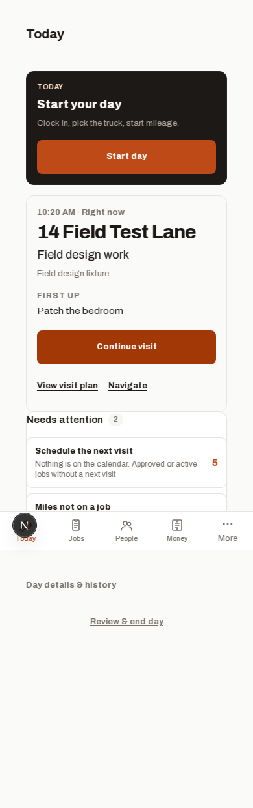
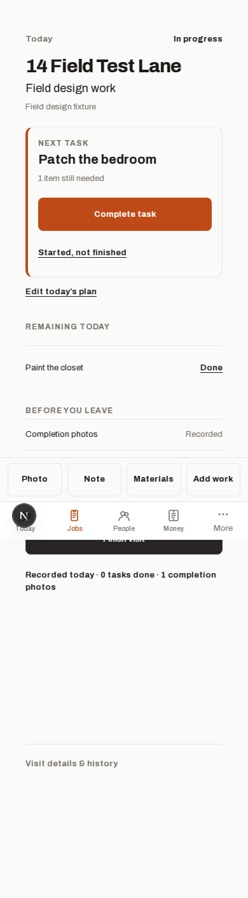
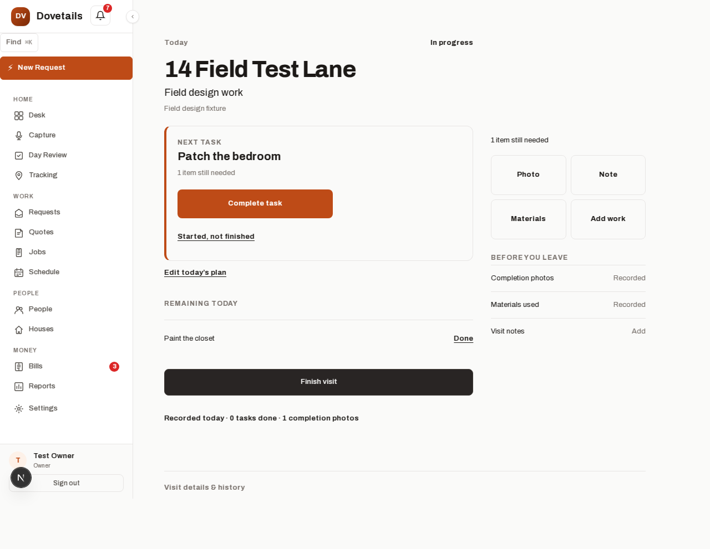

# Today + Active Visit validation

Approved scope: Today and Active Visit only. Baseline commit:
`75ed13f5874a31d42804435279bedd1dca533755`. Implementation branch:
`codex/today-active-visit`. User approved the design before implementation.

## Objective and changes

Today leads with the house and next task, keeps active carry-over accessible
independently of mileage setup, and excludes future scheduled work. Active Visit
provides direct Photo, Note, Materials, and Add work tools, explicit partial-task
remainders, and recorded-before-leaving indicators. Return and whole-job closeout
continue through the existing completion packet and billing handlers. Clock,
vehicle, mileage, and explicit invoice sending remain independent.

Changes are in `apps/web/app/app/my-day`, `my-work/page.tsx`, `visits/[id]`,
`components/visits/CloseoutWizard.tsx`, `components/AppShell.tsx`, the scoped draft
hook, field/Today presentation helpers, and layout CSS. Related unit and browser
tests and TASK-173 were updated. No API routes, tables, migrations, or dependency
versions changed.

Edited drafts survive same-tab interruptions for eight hours, scoped by account,
user, and visit. Current server notes are preserved on conflict, with explicit
restoration of earlier edits. Failed saves retain text; planner load failures
cannot overwrite saved selections. Existing recording/completion hash links
still reach the moved tools.

## Commands and results

- Final static gate: `npx --yes pnpm@9.12.0 gate:fast` passed on 2026-10-04
  (lint, Knip, migration/RLS checks, typecheck, production build, and unit tests,
  including 2,038 web unit tests).
- Integration: `pnpm test:integration` using isolated PostgreSQL 16 with repo
  migrations, seeds, and restricted runtime role: 203 passed, 3 skipped on
  2026-10-04 (182 web and 21 worker passed).
- Field Playwright run: all 35 checks passed on 2026-10-04 across admin, tech,
  jobs/visits, Today, day review, and eight new regressions, including existing
  deep links. These exercise real task and note saves, photo
  uploads, materials, return/whole-job closeout, retained payroll clock, held
  invoice creation, failed-save retry, draft interruption, and planner failure.
- Required release core flow: all nine checks passed on 2026-10-04 through client/job/visit,
  estimate approval, invoice creation, payment, and paid-invoice verification.
- Read-only review identified draft-restoration and planner-loading data-loss
  risks; both were fixed and re-reviewed. Final follow-up found no important
  regressions in deep links, maintenance media, or visit-detail FAB hiding.
- `git diff --check` is included in final branch checks.

Browser verification used Chromium 133 through Playwright. Docker and the normal
browser download were unavailable; temporary native database/browser launch
overrides were outside the repository. Email delivery was disabled for fixtures.
No production visit or live customer message was used.

The combined 44-check browser run passed 42 checks, timed out at payment when
the development server restarted at its memory threshold, and skipped the
dependent paid-invoice check. The core flow was then rerun separately with a
larger test-server heap: all nine checks passed. No production configuration
was changed.

## Limits and follow-up

The entire browser suite is not green. A broader run encountered unrelated
estimate smoke failures and an invoice-conversion test with old client-selection
expectations. Two representative failures reproduced on unchanged main with a
separate clean database. Those tests need a separate update; the required
nine-step release flow passed. Physical-device camera capture, actual email
delivery, merge, and deployment were not performed.

## Screenshots

Seeded test data only. Mobile screenshots are full-page captures; fixed bars
appear at the original viewport boundary.

